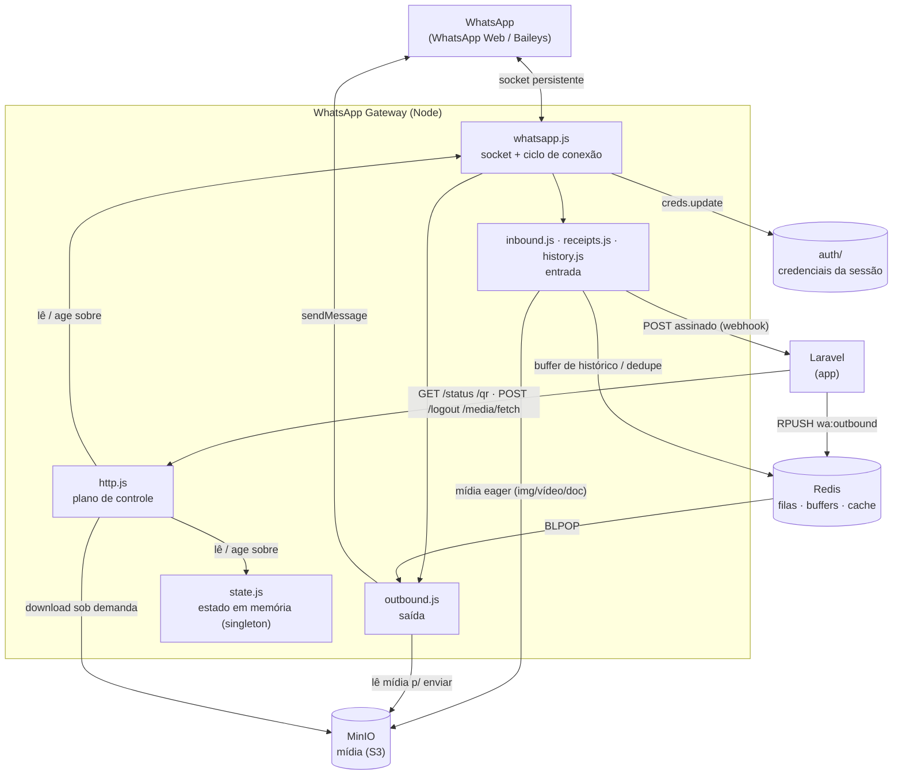
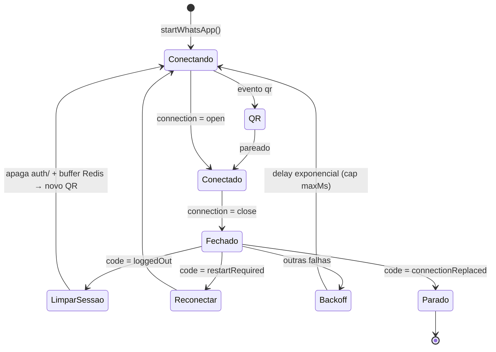
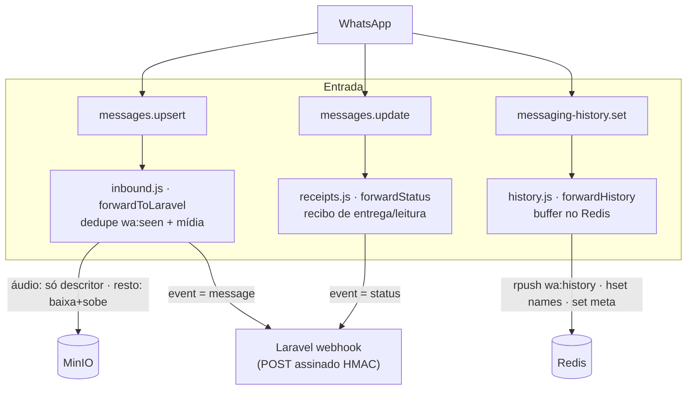
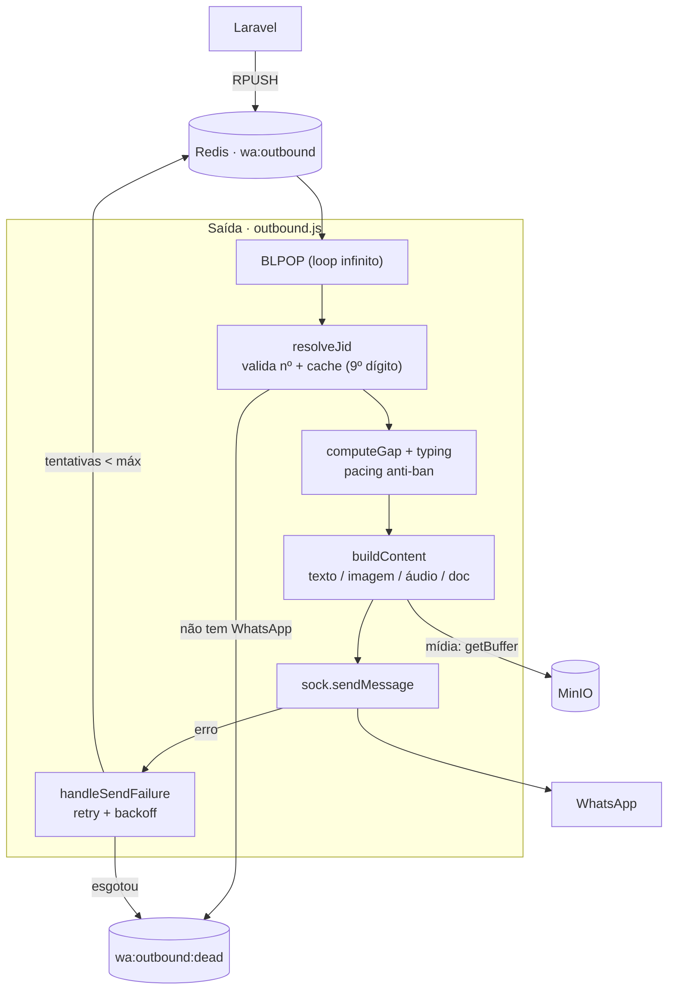

# WhatsApp Gateway (Baileys)

Microserviço Node que mantém a conexão com o WhatsApp (via [Baileys](https://github.com/WhiskeySockets/Baileys)) e atua como **ponte bidirecional** com o Laravel: recebe mensagens/eventos do WhatsApp e os entrega ao backend, e envia mensagens que o backend enfileira. A sessão é persistida em `auth/` (escaneia o QR uma vez só), e a mídia trafega pelo MinIO.

> ⚠️ **Baileys é não-oficial** (engenharia reversa do WhatsApp Web). Há risco de ban do número. Para produção séria, avaliar a WhatsApp Business Cloud API (Meta).
>
> ⚠️ **Segurança em modo de desenvolvimento.** A porta de controle HTTP (`8083:3000`) está exposta e a autenticação dos endpoints sensíveis (`/media/fetch`, `/logout`) está **desativada temporariamente**. Reativar antes de produção — ver a seção **Melhorias Futuras e Refatoração** no fim.

---

## 🏗️ Arquitetura Geral

O gateway é um processo Node único (`type: module`) que sobe **quatro planos** sobre um mesmo socket Baileys:

* **Plano de Conexão** — o núcleo. Mantém o socket persistente com o WhatsApp, gerencia o ciclo de vida (QR → pareado → reconexão/logout) e despacha os eventos brutos. Arquivo: `whatsapp.js`.
* **Plano de Entrada** (WhatsApp → Laravel) — mensagens recebidas, recibos de entrega/leitura e sincronização de histórico. Arquivos: `inbound.js`, `receipts.js`, `history.js`.
* **Plano de Saída** (Laravel → WhatsApp) — consome a fila Redis `wa:outbound` e envia, com pacing anti-ban, validação de número e retry/dead-letter. Arquivo: `outbound.js`.
* **Plano de Controle** (HTTP) — status/QR, logout, validação de número e download de mídia sob demanda. Arquivo: `http.js`.

O estado vivo (conexão, QR, jid, progresso de histórico) mora num singleton em memória (`state.js`). As dependências externas são **Redis** (filas, buffers, cache), **MinIO** (mídia) e o **webhook do Laravel** (entrega assinada por HMAC).



---

### Plano de Conexão

O `startWhatsApp(handlers)` carrega as credenciais de `auth/` (`useMultiFileAuthState`), abre o socket (`makeWASocket`) e registra os listeners de eventos. O ciclo de vida é uma máquina de estados dirigida pelo evento `connection.update` do Baileys, com tratamento específico por motivo de desconexão.



#### Pontos-chave do plano de conexão

* **Sessão persistente em `auth/`**: o `useMultiFileAuthState` lê/grava as credenciais no volume; `creds.update` salva incrementalmente. Pareia o QR uma vez só.
* **Logout = limpeza total + novo QR**: em `loggedOut`, reconectar com a credencial inválida geraria *loop* de logout. Por isso o handler **apaga `auth/`** e **limpa o buffer de histórico no Redis** (`wa:history`, `:names`, `:meta`), recria o socket e emite um QR novo — autocura sem intervenção manual.
* **Reconexão com backoff exponencial**: falhas comuns disparam `setTimeout` com `baseMs * 2^n` limitado a `maxMs`. `restartRequired` reconecta na hora; `connectionReplaced` (outra sessão do mesmo número assumiu) **não** reconecta, pra evitar guerra de sessões.
* **Filtragem na fonte**: `messages.upsert` ignora `fromMe` e mensagens vazias antes de despachar; `connection.update` atualiza o `state` (conectado, qr, jid, `reconnectAttempts`) que o plano de controle expõe.
* **QR em dois canais**: o QR é logado no terminal (`qrcode-terminal`) **e** disponibilizado como imagem em `/qr` e `/status` (`qr_image`).

---

### Plano de Entrada (WhatsApp → Laravel)

Três fluxos distintos saem do WhatsApp para o Laravel. Mensagens e recibos vão pelo **webhook assinado** (HMAC); o histórico (volumoso) é **bufferado no Redis** para o Laravel drenar de forma assíncrona.



#### Pontos-chave do plano de entrada

* **Idempotência por `wa:seen:{id}`**: cada mensagem ao vivo tenta `SET … NX EX`. Se a chave já existe, é duplicata (reentrega do WhatsApp) e é descartada. TTL curto (`WA_DEDUPE_TTL`, 1h) — memória de curto prazo.
* **Mídia: áudio sob demanda, resto eager**: imagem/vídeo/documento são **baixados na hora** e subidos ao MinIO (`storeMedia`). Áudio **não** é baixado — salva-se só um **descritor** (proto base64 + metadados) que permite baixar depois via `/media/fetch`. Evita estourar storage com voice notes.
* **Histórico bufferado, não webhook**: o history sync chega em *chunks* (`messaging-history.set`) com milhares de mensagens. Em vez de N webhooks, faz `rpush` na lista `wa:history` (chaves cruas, sem prefixo) que o Laravel drena em lote. Nomes de **grupos** (`subject`) e **contatos** (`name`/`notify`) vão pro hash `wa:history:names`.
* **Sinal de fim de histórico**: no último chunk (`isLatest`), grava `wa:history:meta = { total, ready }`. O `state.history = { progress, is_latest, at }` é atualizado a cada chunk e exposto em `/status`. ⚠️ O `isLatest` do Baileys nem sempre vem — quem consome deve usar **atividade recente** (`at`) como sinal complementar.
* **Recibos só de mensagens próprias**: `forwardStatus` mapeia o código numérico do WhatsApp (`0..5`) para `error/pending/sent/delivered/read/played` e só encaminha updates de `fromMe`.
* **Webhook assinado**: `postToLaravel` envia `X-WA-Signature: sha256=<hmac>` (segredo compartilhado). Falha de rede/erro do Laravel é logada mas não derruba o gateway.

> 🔧 **Nota de estado:** o *receiver* do webhook no lado Laravel (mensagem/recibo ao vivo) ainda **não está implementado** — hoje só o caminho de **histórico** (buffer Redis) está ligado de ponta a ponta. O gateway já emite tudo; falta o endpoint do outro lado.

---

### Plano de Saída (Laravel → WhatsApp)

O Laravel **enfileira** mensagens em `wa:outbound` (Redis). O gateway consome em loop bloqueante (`BLPOP`), valida o destinatário, aplica pacing humano e envia. Falhas têm retry com backoff e, no limite, vão pra dead-letter.



#### Pontos-chave do plano de saída

* **Fila bloqueante em conexão dedicada**: o `BLPOP` roda numa segunda conexão Redis (`blockingRedis`), separada da conexão de comandos (`redis`) — um cliente bloqueado não trava o resto.
* **Re-enfileira se desconectado**: se não há socket no momento do envio, o job volta pro topo da fila (`lpush`) e espera — nada é perdido durante reconexão.
* **Validação de destinatário (fail-open)**: `resolveJid` consulta `onWhatsApp` com cache no Redis (`wa:jid:{n}`), resolvendo o **9º dígito brasileiro**. Número inexistente → dead-letter + webhook `invalid_recipient`. Erro de consulta → usa o JID montado (não bloqueia o envio).
* **Pacing anti-ban**: `computeGap` calcula um intervalo proporcional ao tamanho do texto (saturando em `charSaturation`) com *jitter* aleatório, e mostra o indicador "digitando" antes de mandar texto. Simula comportamento humano.
* **Mídia a partir do MinIO ou URL**: `buildContent` lê o buffer do MinIO (`getBuffer` pela `key`) ou baixa de uma `url`, e monta o payload por tipo (`image`/`video`/`audio`/`document`/`text`).
* **Retry com backoff → dead-letter**: falha de envio reenfileira com `retryBaseMs * tentativa` até `maxAttempts`; esgotado, vai pra `wa:outbound:dead` com o erro carimbado.

---

### Plano de Controle (HTTP)

Servidor HTTP cru (`node:http`) na porta `HTTP_PORT` (3000). Usado pelo Laravel para status/QR e ações pontuais.

| Método | Rota | Descrição |
| --- | --- | --- |
| `GET` | `/health` | Liveness simples (`{status:"ok"}`). |
| `GET` | `/status` | Estado completo: `connected`, `jid`, `uptime_s`, `has_qr`, `qr_image` (dataURL), `last_disconnect`, `reconnect_attempts`, `history`. |
| `GET` | `/qr` | Página HTML com o QR (auto-refresh). |
| `POST` | `/media/fetch` | Baixa mídia sob demanda a partir do `descriptor` (proto base64) → sobe ao MinIO → devolve `{bucket, key, mimetype, size}`. |
| `POST` | `/logout` | `sock.logout()` — encerra a sessão (dispara a limpeza + novo QR). |
| `GET` | `/check?number=` | Valida se um número tem WhatsApp (`onWhatsApp`). |

---

## 🧱 Estrutura de Módulos

| Módulo | Descrição |
| --- | --- |
| 🚀 `index.js` | *Bootstrap*: sobe o HTTP, garante o bucket MinIO, inicia o WhatsApp (injetando os handlers) e o loop de saída. Trata `SIGTERM`/`SIGINT`. |
| 🔌 `whatsapp.js` | Núcleo de conexão: socket Baileys, ciclo de vida (`connection.update`), reconexão/logout (`scheduleReconnect`) e *fan-out* dos eventos (`messages.upsert`, `messages.update`, `messaging-history.set`). |
| 📥 `inbound.js` | `forwardToLaravel`: dedupe, tratamento de mídia (áudio→descritor; resto→MinIO) e POST do evento `message` ao Laravel. |
| 🧾 `receipts.js` | `forwardStatus`: traduz o código de status do WhatsApp e encaminha o evento `status` (só `fromMe`). |
| 🗂️ `history.js` | `forwardHistory`: normaliza e *bufferiza* o history sync no Redis (mensagens, nomes, meta). |
| 📤 `outbound.js` | `startOutboundLoop`: consumidor `BLPOP` da fila de saída — validação, pacing, envio, retry e dead-letter. |
| 🌐 `http.js` | Plano de controle HTTP (`/health /status /qr /media/fetch /logout /check`). |
| 🧩 `parse.js` | Parsing compartilhado: detecção de mídia, extração de texto, `audioMeta`, e `encodeMessage`/`decodeMessage` (proto ↔ base64, preserva campos binários). |
| ☁️ `media.js` | Cliente MinIO: `ensureBucket`, `putBuffer`, `getBuffer`. |
| 🔢 `numbers.js` | `resolveJid`: validação de número via `onWhatsApp` com cache (resolve 9º dígito BR), *fail-open*. |
| 📡 `laravel.js` | `postToLaravel`: webhook de saída assinado por HMAC (`X-WA-Signature`). |
| 🗃️ `redis.js` | Dois clientes ioredis: `redis` (comandos) e `blockingRedis` (`BLPOP`). |
| 📊 `state.js` | Singleton de estado em memória (conexão, qr, jid, `lastDisconnect`, `history`, `sock`). |
| ⚙️ `config.js` | Configuração centralizada a partir de variáveis de ambiente. |
| 📝 `logger.js` | Logger `pino` (nível por `LOG_LEVEL`). |

---

## 🗃️ Chaves Redis

| Chave | Tipo | Quem escreve | Papel |
| --- | --- | --- | --- |
| `wa:outbound` | list | Laravel (`RPUSH`) → gateway (`BLPOP`) | Fila de mensagens a enviar. |
| `wa:outbound:dead` | list | gateway | Dead-letter (falha definitiva / destinatário inválido). |
| `wa:seen:{id}` | string (TTL) | gateway | Dedupe de mensagens recebidas (idempotência). |
| `wa:history` | list | gateway → Laravel drena | Buffer do history sync. |
| `wa:history:names` | hash | gateway | `jid → nome` (grupos + contatos). |
| `wa:history:meta` | string | gateway | `{ total, ready }` no fim do sync. |
| `wa:jid:{number}` | string (TTL) | gateway | Cache de resolução número → JID. |

> As chaves de histórico e `wa:outbound` são **cruas** (sem prefixo Laravel) por serem compartilhadas entre o gateway e o backend.

---

## ⚙️ Configuração (env)

Ver `.env.example`. Principais:

| Var | Default | Descrição |
| --- | --- | --- |
| `REDIS_HOST` / `REDIS_PORT` | `redis` / `6379` | Redis. |
| `LARAVEL_WEBHOOK_URL` | `http://app/api/whatsapp/webhook` | Webhook de entrada. |
| `WEBHOOK_SECRET` | — | Segredo do HMAC (definir via `WHATSAPP_WEBHOOK_SECRET` no `.env` da raiz). |
| `AUTH_DIR` | `/app/auth` | Pasta da sessão. |
| `HTTP_PORT` | `3000` | Porta do plano de controle. |
| `WA_OUTBOUND_KEY` | `wa:outbound` | Fila de saída. |
| `WA_SYNC_FULL_HISTORY` | `false` | `true` puxa o histórico mais completo que o celular enviar (volume alto). |
| `WA_SEND_GAP_MIN_MS` / `MAX_MS` | `3000` / `8000` | Janela de pacing anti-ban. |
| `WA_VALIDATE_RECIPIENT` | `true` | Valida número antes de enviar. |
| `MINIO_*` | — | Endpoint/credenciais/bucket da mídia. |

---

## 🚀 Operação

```bash
# Subir e ver o QR no primeiro start
docker compose up -d whatsapp
docker compose logs -f whatsapp
```

Escaneie o QR em: WhatsApp > **Aparelhos conectados** > **Conectar aparelho**.

```bash
# Reparear do zero (apaga a sessão)
docker compose stop whatsapp
rm -rf whatsapp/auth/*
docker compose up -d whatsapp && docker compose logs -f whatsapp

# Enviar mensagem de teste (pela fila Redis)
docker compose exec redis redis-cli RPUSH wa:outbound \
  '{"jid":"5511999999999@s.whatsapp.net","text":"Olá do gateway!"}'

# Conferir status / desconectar
curl localhost:8083/status
curl -X POST localhost:8083/logout
```

---

## 🛣️ Melhorias Futuras e Refatoração

> Itens em radar para evolução do gateway. **Ordem dentro de cada bloco segue prioridade decrescente.**

### Prioridade máxima — Reativar a camada de segurança

A autenticação por segredo (`X-Webhook-Secret`) foi **removida temporariamente** durante o desenvolvimento, e a porta `8083` está exposta. Hoje qualquer um na rede pode chamar os endpoints — sendo o `/qr` o mais perigoso (quem o vê pode **parear o próprio aparelho** e sequestrar a sessão).

| # | Ação | Risco | Ganho |
| --- | --- | --- | --- |
| 1 | Reativar o guard `X-Webhook-Secret` em `/media/fetch` e `/logout` | Baixo | Fecha as ações sensíveis |
| 2 | Proteger `/qr`, `/status`, `/check` (mesmo guard) | Baixo | Fecha o vetor de sequestro de sessão |
| 3 | Alinhar `WHATSAPP_WEBHOOK_SECRET` nos dois lados (`.env` raiz + `src/.env`) | Baixo | Destrava o secret de ponta a ponta |
| 4 | Não expor a porta `8083` em produção (rede interna só) | Baixo | Remove o acesso externo |

### Outras melhorias

* **Implementar o webhook do lado Laravel** (entrada ao vivo): hoje `inbound.js`/`receipts.js` postam para um endpoint que ainda não existe. Sem ele, só o histórico está ligado.
* **Nomes de contatos individuais**: o history sync só traz nome de **grupo** (`subject`). Escutar `contacts.upsert`/`contacts.update` para popular `wa:history:names` com `name`/`notify` dos contatos e fazer *backfill* das conversas.
* **Sinal de fim de buffering mais confiável**: o `is_latest` do Baileys fica preso em `false` após terminar. Expor um *heartbeat* de atividade (`history.at`) ou consolidar via `wa:history:meta.ready` em vez de depender só do flag.
* **Reprocessar a dead-letter**: `wa:outbound:dead` acumula sem mecanismo de *replay*. Definir comando/rota para reinjetar ou descartar.
* **Mídia totalmente sob demanda**: hoje só áudio é lazy; imagem/vídeo/doc baixam na hora. Aplicar o mesmo descritor a todos reduz storage (com a ressalva de que mídia do WhatsApp expira).
* **Múltiplos workers de saída / *backpressure***: o `BLPOP` é um único consumidor. Em surto, escalar consumidores ou definir teto de fila.
* **Limpeza em `connectionReplaced`**: hoje só `loggedOut` limpa o buffer de histórico — avaliar se `connectionReplaced` também deveria.
* **Reconexão sem teto de tentativas**: o backoff cresce até `maxMs` mas nunca desiste — considerar alerta/healthcheck após N falhas.
* **Logs por nível**: padronizar `debug`/`info`/`warn`/`error` para facilitar filtro em produção.
